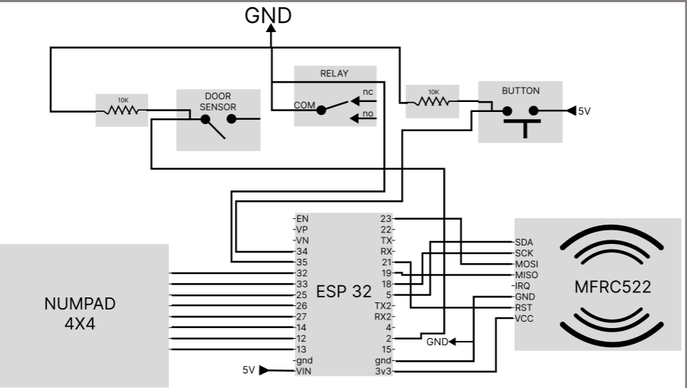

# 🔐 Smart Door Lock - IoT System (ESP32)

Proyek ini merupakan bagian dari sistem kunci pintu pintar berbasis IoT yang menggunakan mikrokontroler ESP32. Sistem ini terhubung ke Firebase Realtime Database dan menggunakan metode autentikasi seperti RFID, PIN keypad, dan sensor pintu untuk mengontrol akses secara aman dan efisien.

## 📁 Repository Contents

- `numpaddd/` - Contoh penggunaan numpad dengan ESP32.
- `rfiddoor/` - Contoh penggunaan sensor RFID dengan ESP32.
- `offlinecode/` - Versi kode untuk sistem yang bekerja tanpa internet/Firebase.
- `code/` - Kode utama yang terintegrasi dengan Firebase Realtime Database.
- `secrets.h` - File yang menyimpan data sensitif seperti kredensial Wi-Fi dan Firebase.

## ⚙️ Setup Instructions

1. 🔌 Hubungkan ESP32 ke komputer menggunakan kabel USB.
2. ☁️ Buat proyek di Firebase dan atur Realtime Database serta Authentication.
3. ✏️ Edit `secrets.h` untuk menambahkan:
   - 📶 SSID dan password Wi-Fi
   - 🔑 API key dan URL Firebase
   - 📧 Email dan password Firebase (jika menggunakan auth)
4. ⬆️ Upload kode dari folder `code/` ke ESP32 menggunakan Arduino IDE / PlatformIO.
5. ✅ Uji fungsi RFID, keypad, dan sensor pintu sebelum digabungkan ke sistem utama.

## 🌟 Features

- 🔒 Akses via RFID, PIN keypad, dan sensor pintu.
- 📡 Update status pintu secara real-time ke Firebase.
- 🔌 Bisa dijalankan secara offline tanpa internet (mode offline).
- 🛠️ Konfigurasi mudah lewat file `secrets.h`.

## 📝 Catatan

- Pastikan koneksi internet stabil untuk ESP32 jika menggunakan Firebase.
- Jaga kerahasiaan file `secrets.h`.
- Uji setiap komponen secara terpisah sebelum integrasi.
---

## 🖼️ Circuit Diagram

---

